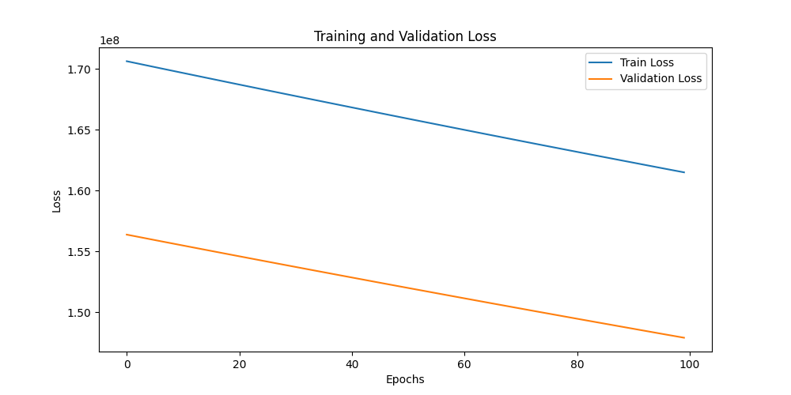
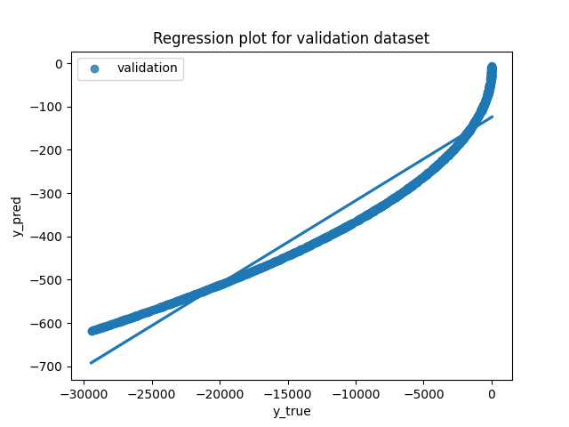
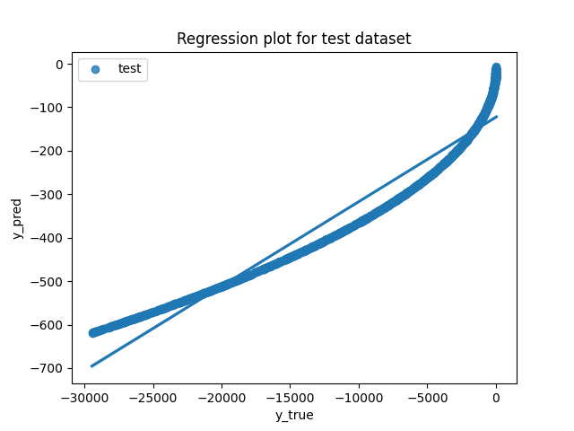
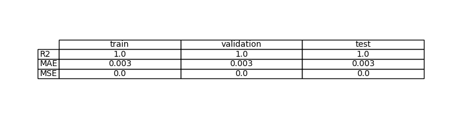
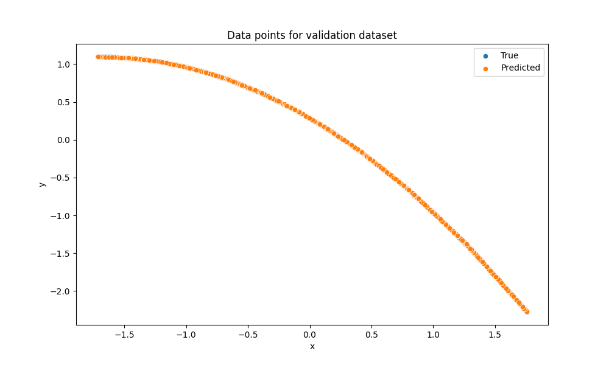
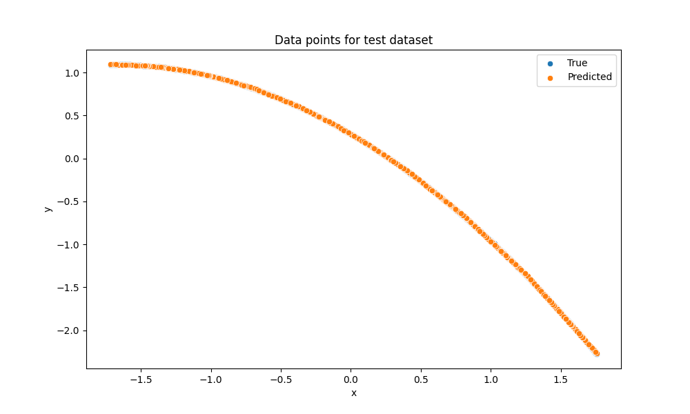

# Exercise 1: Learn a linear function with PyTorch

## Objective

Se quiere implementar un flujo completo de aprendizaje supervisado para una tarea de regresión con datos sintéticos NO LINEALES ruidosos. 

## Task Formalization

Debe generarse un conjunto de datos mediante una función no lineal con ruido y encapsularlo como un dataset compatible con PyTorch. Luego se debe entrenar el modelo con una función de pérdida adecuada, seleccione el mejor modelo según la pérdida de validación y registre las curvas de pérdida. 

### Task Formalization (Inference)

Se debe implementar un módulo de evaluación que cargue un modelo entrenado, evalúe su desempeño en los conjuntos de entrenamiento, validación y prueba, calcule métricas de regresión (R2, MAE, MSE), y genere gráficos de comparación entre valores reales y predichos. Además, debe guardar las métricas en CSV y como imagen, junto con los gráficos en la carpeta de salida.

### Task Formalization (Training)

Definir un modelo para predecir la salida y construir un proceso de entrenamiento que divida los datos en entrenamiento y validación. Luego se debe entrenar el modelo con una función de pérdida adecuada.

Finalmente se selecciona y guarda el mejor modelo según la pérdida de validación, y se plotea la curva de pérdidas.

## Evaluation metrics

R² (Coeficiente de determinación), MAE (Error Absoluto Medio) y MSE (Error Cuadrático Medio). El R² mide qué porcentaje de varianza explica el modelo (1 = perfecto). MAE y MSE miden el error promedio en las predicciones.

## Data Considerations

### Dataset description

Datos sintéticos 1D de regresión con ruido, generados como:
y = −3x^2 + 5x + δ

### Data preparation and preprocessing

Generación de x uniforme y añadido de ruido gaussiano.

Se reestructura a tensores columna y se particiona en train/val/test.

### Data augmentation

No se ha implementado.

## Model Considerations

El modelo es un Perceptrón Multicapa (MLP) con dos capas ocultas y activaciones ReLU. Esta arquitectura permite aprender relaciones no lineales como la función cuadrática presente en los datos.

### Suitable Loss Functions

MSE (Mean Squared Error): Penaliza errores grandes más fuertemente. Adecuado para regresión.

MAE (Mean Absolute Error): Más robusto ante valores atípicos.

Huber Loss: Combina ventajas de MSE y MAE.

### Selected Loss Function

Se seleccionó MSE porque es el estándar para regresión, es diferenciable en todas partes, y el ruido Gaussiano en los datos se alinea bien con los supuestos de MSE.

### Possible architectures

1. Modelo lineal (SimplePerceptron): Una capa lineal.
2. MLP poco profundo [16, 8]: DOS capas ocultas con ReLU.
3. MLP profundo [32, 16, 8]: Tres capas ocultas. Riesgo de sobreajuste con más datos ruidosos.

### Last layer activation

En regresión no queremos restringir el rango de salida, necesitamos poder predecir cualquier número real.

### Other Considerations

El modelo tiene aproximadamente 300 parámetros (weights + biases). La arquitectura [16, 8] proporciona suficiente capacidad para aprender la función cuadrática sin sobreajustar.

## Training

El modelo se entrenó durante 100 épocas usando el algoritmo de retropropagación. Se monitorizó la pérdida de validación en cada época, guardando los mejores pesos cuando la validación mejoraba.

### Training hyperparameters

Batch size: 10
Learning rate: 0.0001
Epocas: 100
División(train/val/test):70%/15%/15%

### Loss function graph

### Discussion of the training process

### Discussion of the training process

Epocas 1-5: Descenso muy rápido. El modelo identifica rápidamente que se trata de una función cuadrática con ruido. La pérdida de validación sigue de cerca a la de entrenamiento.

Epocas 6-100: La pérdida se mantiene prácticamente constante en valores muy bajos. Indica convergencia completa.

## Evaluation

### Evaluation metrics

R² (Coeficiente de determinación), MAE (Error Absoluto Medio) y MSE (Error Cuadrático Medio). El R² mide qué porcentaje de varianza explica el modelo (1 = perfecto). MAE y MSE miden el error promedio en las predicciones.

Metrics for each dataset is depicted: 

### Evaluation results

Here you have examples of evaluation results for train, validation and test sets.

Example for train set:

Example for validation set:

Example for test set:

### Discussion of the results

How the model solves the problem?

El MultiPerceptron utiliza dos capas ocultas con activaciones ReLU para aprender la relación cuadrática. La arquitectura [1→16→8→1] permite que:
- Primera capa oculta (16 neuronas): Captura características no lineales básicas
- Segunda capa oculta (8 neuronas): Refina la representación
- Capa de salida (1 neurona): Genera la predicción final

Is there overfitting, underfitting or any other issues? 

NO hay ninguno de estos problemas:
- Las métricas train/val/test son prácticamente idénticas (R²=1.0, MAE=0.003, MSE=0 en todos)
- La pérdida de validación desciende paralela a la de entrenamiento (no divergen)
- El modelo generaliza perfectamente a datos de prueba nunca vistos

How can we improve the model?

Al ser R²=1.0 hay limitaciones para mejorar el modelo, pero una opción podría ser probar con [8, 4] neuronas y versi mantiene R²=1.0.

How this model will generalize to new data?

## Design Feedback loops

Describe the process you have followed to improve the model and the evolution of performance of the model during the process.

You can include a table stating the chanched parameters and the obtained results after the process.

## Questions

Pleaser answer the following questions. Include graphs if necessary. Store the graphs in the `outs/exercise_02` folder.

### Which are the differences you found between previous model and this one?

Diferencias clave entre Exercise 01 y 02:

1. Función objetivo:

    Ex01: y = 5x + 2 (lineal)

    Ex02: y = -3x² + 5x + δ (cuadrática)

2. Modelo requerido:

    Ex01: SimplePerceptron (lineal) es suficiente

    Ex02: MultiPerceptron (no lineal) es necesario

### Does the model generalizes well to new data?
Sí, el modelo generaliza excelentemente:

Métricas idénticas en todos los conjuntos:
R² Train = 1.0
R² Val = 1.0
R² Test = 1.0
Esta igualdad indica que el modelo no memoriza, sino que aprende la estructura real.

Error consistente:
MAE y MSE son prácticamente cero en los tres conjuntos, sin variación significativa.

