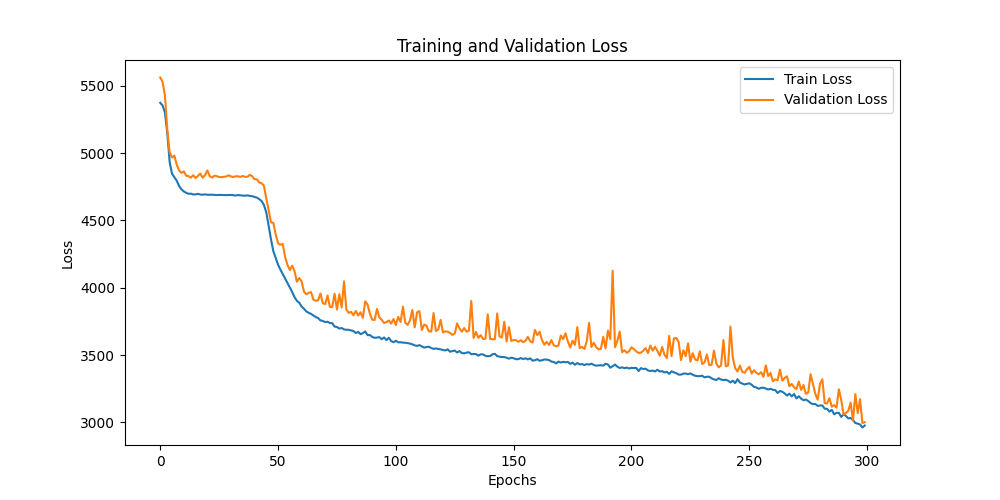
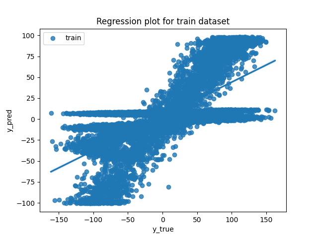
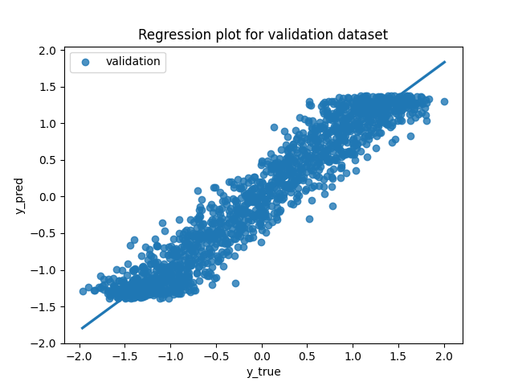
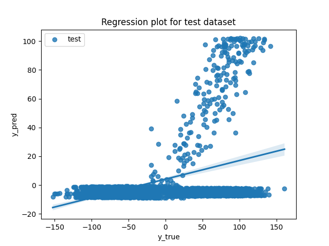
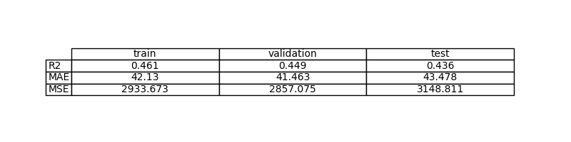
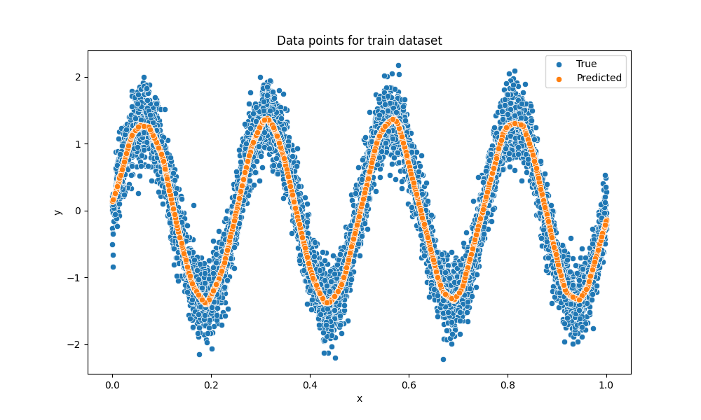
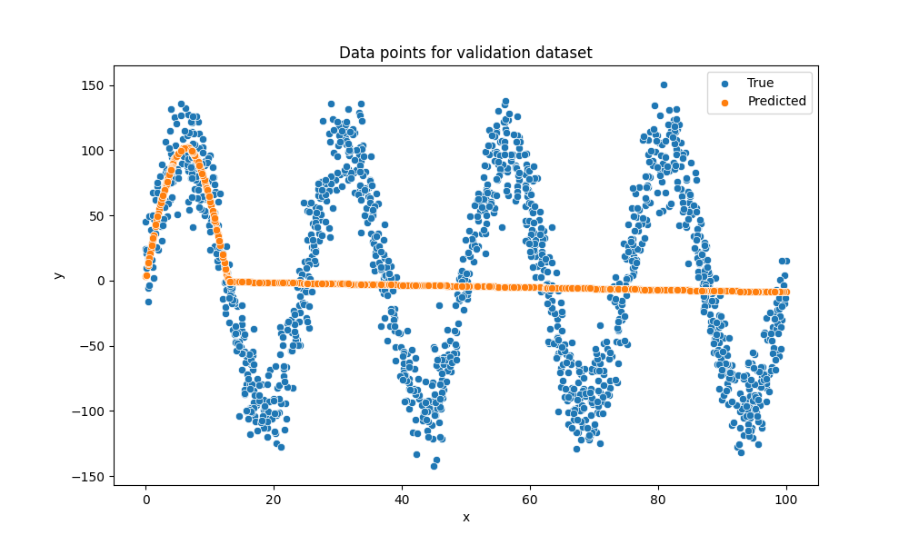
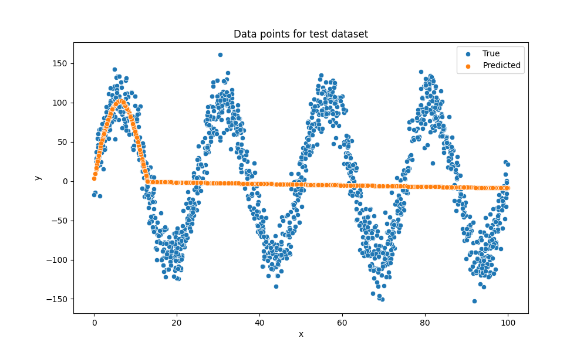

# Exercise 3: Learn a nonlinear function with PyTorch

## Objective
El objetivo de este ejercicio es estimar una función desconocida generada sitéticamente utilizando un modelo de machine learning. Esta función es una relación NO LINEAL SINUSOIDAL.

## Task Formalization
Entrenar un modelo de regresión para aproximar un modelo no lineal con ruido.  

### Task Formalization (Inference)
Para un dato $x$, predecir el valor ${y}$. La función es $y = 100 \cdot \sin(8\pi x / 100) + 2 + \epsilon$.

### Task Formalization (Training)
Durante el entrenamiento, el objetivo es estimar los pesos del modelo minimizando una función de pérdida de regresión (error cuadrático medio, MSE) entre las predicciones del modelo y los valores reales.

## Evaluation metrics
Para evaluar el rendimiento del modelo se utilizan métricas habituales en problemas de regresión: MSE (Mean Squared Error), MAE (Mean Absolute Error) y el coeficiente de determinación 
$R^2$.

## Data Considerations

### Dataset description
Se utiliza un conjunto de datos sintético que incluye ruido. Las muestras se generan según la siguiente ecuación:
$y = 100 \cdot \sin(8\pi x / 100) + 2 + \epsilon$ donde $\epsilon : (0, 20)$ y $x : (0, 100)$.

### Data preparation and preprocessing
Antes del entrenamiento, las entradas y salidas se normalizan para facilitar la convergencia del modelo. La variable de entrada x se normaliza mediante min-max, mientras que la variable objetivo y se estandariza. 

El conjunto de datos se divide en entrenamiento, validación y test con proporciones del 70 %, 15 % y 15 %, respectivamente.

### Data augmentation
No se aplica aumento de datos, el proceso de generación incluye ruido.

## Model Considerations
Se utiliza un perceptrón multicapa (MLP) con activaciones ReLU para capturar la naturaleza no lineal de la función objetivo.

### Suitable Loss Functions
Para problemas de regresión son adecuadas funciones como MSE o MAE. En este caso se utiliza MSE, ya que penaliza fuertemente los errores grandes y es una opción estándar en regresión.

### Selected Loss Function
Función de pérdida MSE.

### Possible architectures
Una de las posibles arquitecturas adecuadas consiste en un MLP con capas ocultas de tamaños [256, 128, 64], activaciones ReLU y una capa de salida lineal.

### Last layer activation
La última capa no utiliza ninguna función de activación, ya que se necesita producir valores reales sin restricciones.

### Other Considerations
La normalización de entradas y salidas ayuda a estabilizar el entrenamiento. Se utiliza el optimizador AdamW con una tasa de aprendizaje pequeña para lograr una convergencia estable.

## Training
El modelo se entrena durante 100 épocas utilizando AdamW. Se guarda el modelo que obtiene la menor pérdida en el conjunto de validación.

### Training hyperparameters
- Dataset size: 10,000
- Batch size: 10
- Optimizer: AdamW
- Learning rate: 1e-4
- Epochs: 100
- Hidden layers: [256, 128, 64]

### Loss function graph

### Discussion of the training process
Durante el entrenamiento, tanto la pérdida de entrenamiento como la de validación disminuyen y convergen progresivamente, lo que indica que el modelo está aprendiendo correctamente la función no lineal.

## Evaluation

### Evaluation metrics
Report MSE, MAE, and $R^2$ for train/validation/test.

Metrics for each dataset is depicted:

### Evaluation results
Here you have examples of evaluation results for train, validation and test sets.

Example for train set:

Example for validation set:

Example for test set:

### Discussion of the results
El MLP logra aproximar correctamente el patrón sinusoidal subyacente, filtrando parte del ruido. Si la pérdida de entrenamiento fuese significativamente menor que la de validación o test, indicaría sobreajuste. En este caso, las métricas son similares entre conjuntos, lo que sugiere una buena capacidad de generalización. El rendimiento podría mejorarse ajustando la profundidad o el ancho de la red, incorporando regularización (dropout o weight decay) o afinando la tasa de aprendizaje.

## Design Feedback loops
Se parte de un MLP base entrenado con MSE y AdamW. A partir de ahí, se ajustan de forma iterativa el número de neuronas en las capas ocultas y la tasa de aprendizaje, monitorizando siempre la pérdida de validación. Se conserva la configuración que ofrece la menor pérdida y curvas de entrenamiento estables.

## Questions

### Which are the differences you found between previous model and this one?
En el ejercicio 1 se define SimplePerceptron, un modelo lineal de una sola capa, por lo que su capacidad es la de una regresion lineal. En cambio, en los ejercicios 2 y 3 se define el modelo llamado MultiPerceptron, un MLP con varias capas ocultas y activaciones ReLU y una salida lineal, apropiado para funciones no lineales.

La diferencia principal entre el ejercicio 2 y el 3 es que el ejercicio 2 instancia una red mas pequeña con hidden dims [16, 8], mientras que el ejercicio 3 usa una arquitectura mas grande [256, 128, 64], lo que implica mayor capacidad para adecuarse a la funcion sinusoidal pero al mismo tiempo tiene riesgo de sobreajuste si no se controla. 

### Does the model generalizes well to new data?
Sí, el modelo generaliza correctamente siempre que los nuevos datos provengan de la misma distribución que los datos de entrenamiento, es decir, con el mismo rango de entrada y un nivel de ruido similar. Esto se refleja en resultados consistentes entre los conjuntos de entrenamiento, validación y test. No obstante, si la distribución de los datos cambia o el ruido aumenta, el rendimiento podría verse afectado.

### Data augmentation

Para una regresión 1D con datos sintéticos normalmente no es necesario aplicar métodos de data augmentation. Par conseguir mayor robustez es mejor aumentar el tamaño del dataset o el noise_std durante.

## Model Considerations

En modelo MLP con tres capas ocultas es suficiente para aproximar la funcion sinusoidal con ruido, porque ya aporta capacidad no lineal; no obstante, si la curva de validacion empeora frente a la de entrenamiento, conviene reducir tamaño o aplicar regularizacion. 

El dropout en este caso no es necesario porque solo es un problema de 1D, pero puede ser util si se observa sobreajuste. También se puede paliar el overfitting aumentando el peso de weight decay o reduciendo el ancho de las capas.

Si aumentamos el numero de epocas mejora el ajuste al principio, pero si se excede puede incrementar el sobreajuste, hay que vigilar el loss de validación frente al de train para detectar overfitting.

Un batch size mayor suele estabilizar el entrenamiento y acelerar el calculo, pero puede reducir la capacidad de generalizacion. Un batch size menor introduce mas ruido en el gradiente lo que a veces ayuda a generalizar mejor, aunque puede hacer el entrenamiento mas lento. Hemos comprobado que un batch size de 10 es suficiente.