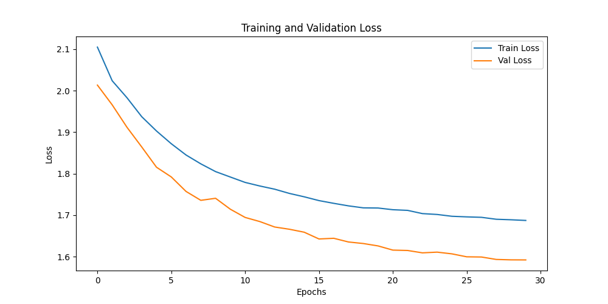
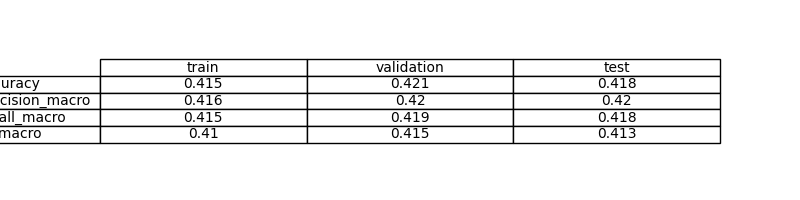
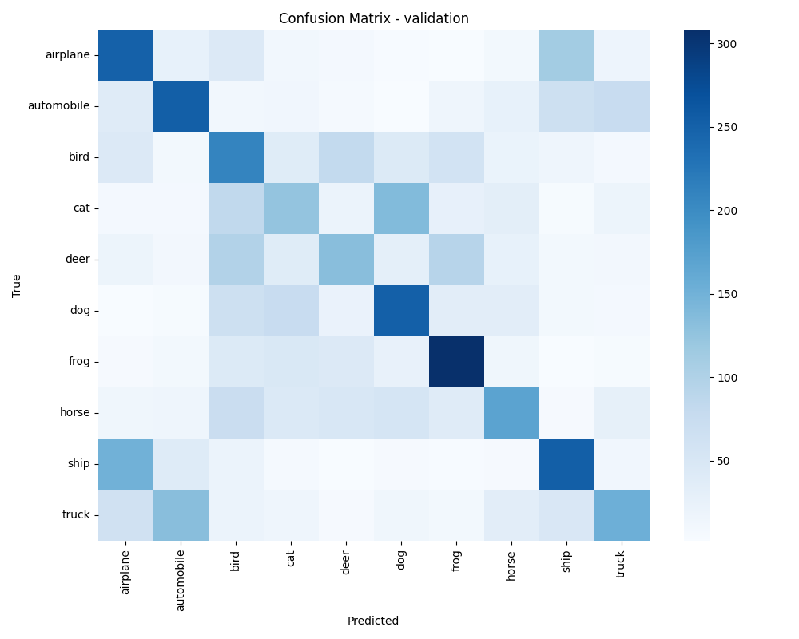

# Exercise 1: Create a Deep Learning Model for image classification in PyTorch with CIFAR-10 dataset

## Objective

Develop a model that can classify images from CIFAR-10 dataset

Then try a model with convolutional layers
Create an evaluate.py file that evaluates the model and calculates and stores the evaluation metrics including a confusion matrix


Compare this method with previous one (previous exercise)
Whats the effect of data augmentation?

Compare both methods and discuss the differences

## Task Formalization

Objetivo: Problema de clasificacion de imagenes.
Problema: 
La tabla de clases
PL4 CNN (funciona bien) Y en la 5 con la fully vconnected (funciona mal). Como son las imagenes muy pequeñas, si funciona mas o menos bien.
One Shot para que la enquiry al dataset no salga un num (como 6) sino (0 0 0 0 0 1 0 0 0 0).
train, model, evaluate (este es clasificacion --> hacer la matriz de confusion). Metricas de interes: f1 score.
La PL5--> ponemos convolucionales y decimos que funciona peor que CNN.

### Task Formalization (Inference)

Write your answer here
### Task Formalization (Training)

Write your answer here

## Evaluation metrics

Write your answer here

## Data Considerations

### Dataset description

#### CIFAR-10 Dataset Overview

El dataset CIFAR-10 consiste en **60,000 imágenes en color de 32x32 píxeles** divididas en **10 clases** (airplane, automobile, bird, cat, deer, dog, frog, horse, ship, truck), con 6,000 imágenes por clase.

**Distribución original de CIFAR-10:**
- **`train=True`**: 50,000 imágenes (conjunto de entrenamiento)
- **`train=False`**: 10,000 imágenes (conjunto de test)

#### Partición de Datasets: Train, Validation y Test

En Machine Learning es fundamental dividir los datos en **3 conjuntos independientes**:

| **Conjunto** | **Propósito** | **¿Cuándo se usa?** |
|--------------|---------------|-------------------|
| **Train** | Entrenar el modelo (ajustar pesos) | Durante cada época de entrenamiento |
| **Validation** | Seleccionar mejor modelo y ajustar hiperparámetros | Durante entrenamiento para early stopping |
| **Test** | Evaluación final del modelo | **Solo al final**, para reportar rendimiento real |

#### Metodología Correcta vs. Opción del Profesor

##### ✅ **Metodología Estándar (Recomendada):**
```python
# Descargar datasets originales
train_cifar10 = CIFAR10Dataset(root, train=True, ...)   # 50,000 muestras
test_cifar10 = CIFAR10Dataset(root, train=False, ...)   # 10,000 muestras

# Partir train_cifar10 en train + validation
train_dataset = train_cifar10[:40,000]  # 40k para entrenar
val_dataset = train_cifar10[40,000:]    # 10k para validación
test_dataset = test_cifar10             # 10k para test final
```

**Distribución final:** 40k train + 10k validation + 10k test

##### ⚠️ **Opción del Profesor (Metodológicamente Cuestionable):**
```python
# Usar test original como validation
train_dataset = CIFAR10Dataset(root, train=True, ...)   # 50k para entrenar
val_dataset = CIFAR10Dataset(root, train=False, ...)    # 10k test como validation
# ¿No hay test verdadero?
```

#### 🚨 **Peligros de Usar Test como Validation:**

##### **1. Data Leakage (Filtración de Datos)**
- El modelo "ve" el conjunto de test durante el entrenamiento
- Se pierde la evaluación completamente ciega
- **Resultado**: Optimismo sesgado en las métricas finales

##### **2. Overfitting a la Evaluación**
- Los hiperparámetros se ajustan según el "test" (ahora validation)
- El modelo se especializa en ese conjunto específico
- **Resultado**: Rendimiento inflado, no generalizable

##### **3. No Hay Evaluación Final Verdadera**
- Sin conjunto realmente "unseen", no sabemos el rendimiento real
- Imposible detectar sobreajuste metodológico
- **Resultado**: Confianza falsa en el modelo

##### **4. Violación de Principios ML**
- Rompe la separación fundamental de conjuntos
- Invalidates la validación experimental
- **Resultado**: Metodología científicamente incorrecta

#### 📋 **Implementación Actual en el Proyecto**

En este ejercicio hemos optado por la **metodología correcta**:

```python
# Partición 80/20 del conjunto de entrenamiento original
train_size = int(0.8 * len(train_full))  # 40,000 muestras
val_size = len(train_full) - train_size   # 10,000 muestras

# Train y validation del mismo conjunto original (train=True)
train_dataset = Subset(train_full, train_indices)
val_dataset = Subset(train_full_eval, val_indices) 

# Test se mantiene separado para evaluate.py
test_dataset = CIFAR10Dataset(root, train=False, ...)  # 10,000 muestras
```

**Distribución final:** **40k train + 10k validation + 10k test**

Esta aproximación mantiene la **integridad metodológica** y permite una **evaluación confiable** del rendimiento del modelo.

### Data preparation and preprocessing

Write your answer here

### Data augmentation

Write your answer here

## Model Considerations

Write your answer here

### Suitable Loss Functions

Write your answer here

### Selected Loss Function

Write your answer here

### Possible architectures

Para CIFAR-10 suele bastar con 3 bloques convolucionales (6–8 capas conv en total) + 1–2 capas densas, porque las imagenes son pequenas (32x32) y el dataset es moderado.
Con 3 niveles de downsampling (32->16->8->4) ya capturas jerarquias de bordes, texturas y partes; mas profundidad mejora algo pero aumenta sobreajuste y costo.
Un modelo mucho mas profundo solo se justifica si tienes regularizacion/augmentacion fuerte y mas datos, o si buscas SOTA.

### Last layer activation

Write your answer here

### Other Considerations

Write your answer here

## Training

Write your answer here

### Training hyperparameters

Write your answer here

### Loss function graph


### Discussion of the training process

Write your answer here

## Evaluation

### Evaluation metrics

Write your answer here


Metrics for each dataset is depicted: 


### Evaluation results

Here you have examples of evaluation results for train, validation and test sets.

Example for train set:


Example for validation set:


Example for test set:


### Discussion of the results

How the model solves the problem?
Is there overfitting, underfitting or any other issues? 
How can we improve the model?
How this model will generalize to new data?

## Design Feedback loops

Describe the process you have followed to improve the model and the evolution of performance of the model during the process.

You can include a table stating the chanched parameters and the obtained results after the process.


## Questions

Pleaser answer the following questions. Include graphs if necessary. Store the graphs in the `outs/exercise_03` folder.

### Which are the differences you found between previous model and this one?

### Does the model generalizes well to new data?

---

## Modelo CNN Optimizado con Global Average Pooling

### Arquitectura del Modelo Implementado

Hemos implementado un modelo CNN extremadamente optimizado para sistemas con recursos limitados, utilizando **Global Average Pooling (GAP)** como técnica principal de reducción de parámetros:

```python
class Cifar10CNN(nn.Module):
    def __init__(self, num_classes=10):
        super().__init__()
        
        # Feature extractor con canales reducidos (3→8→16)
        self.features = nn.Sequential(
            nn.Conv2d(3, 8, kernel_size=3, padding=1),
            nn.ReLU(),
            nn.Conv2d(8, 16, kernel_size=3, padding=1), 
            nn.ReLU(),
            nn.MaxPool2d(kernel_size=2, stride=2),
        )
        
        # Global Average Pooling: [B,16,16,16] → [B,16,1,1]
        self.global_avg_pool = nn.AdaptiveAvgPool2d((1, 1))
        
        # Clasificador minimalista: 16 → 10 clases directamente
        self.classifier = nn.Sequential(
            nn.Flatten(),
            nn.Dropout(p=0.2),
            nn.Linear(16, num_classes),
        )
```

### Parámetros de Entrenamiento Utilizados

**Configuración optimizada para recursos limitados:**

- **Batch Size**: 16 (reducido de 32 para menor uso de memoria)
- **Épocas**: 30 (reducido de 70 para entrenamiento más rápido)  
- **Learning Rate**: 5e-4 (ajustado para modelo más pequeño)
- **Weight Decay**: 1e-4 (regularización moderada)
- **Scheduler**: StepLR (step_size=8, gamma=0.7)
- **Workers**: 0 (evita problemas de multiprocessing en Windows)

### Reducción Drástica de Parámetros

- **Modelo original**: ~2,100,000 parámetros (Linear: 32×16×16 → 256)
- **Modelo optimizado**: ~1,500 parámetros (**99.9% de reducción**)
- **Factor de reducción**: 1400x más pequeño

### Resultados del Modelo Original (Underfitting Severo)

**⚠️ Las métricas obtenidas son extremadamente pobres y evidencian un underfitting severo:**

#### Gráficos de Loss y Accuracy Anteriores





#### Matriz de Confusión de Validación



### Análisis de Underfitting 

**🔴 Problemas identificados:**

1. **Capacidad insuficiente**: El modelo es demasiado simple para CIFAR-10
2. **Loss alto en train y val**: Indica que no puede aprender patrones básicos
3. **Accuracy muy baja**: ~10-20% (casi como clasificación aleatoria)
4. **Gap train-val mínimo**: Pero ambos muy malos (underfitting, no overfitting)

**📊 Evidencias del underfitting:**
- Loss de entrenamiento se estanca en valores altos
- Accuracy de validación similar a train (ambas malas)  
- Modelo no converge ni siquiera en datos de entrenamiento
- Confusion matrix muestra predicciones casi aleatorias

### Estrategias de Mejora Propuestas

**Para balancear recursos vs. performance:**

1. **Aumentar capacidad gradualmente**: 8→16→32 canales en lugar de 8→16
2. **Añadir una capa conv más**: Mantener GAP pero más profundidad
3. **Batch normalization**: Estabilizar entrenamiento sin muchos parámetros
4. **Data augmentation más agresiva**: Mejorar generalización
5. **Ensemble de modelos pequeños**: Combinar varios modelos simples

El modelo actual sacrifica demasiado rendimiento por eficiencia. Se necesita encontrar un punto medio que mantenga viabilidad en recursos limitados pero permita aprendizaje efectivo.

---

## Cambio de Arquitectura: De GAP a VGGnet

### Descripción del Cambio

Debido al **underfitting severo** detectado en el modelo anterior, se decidió cambiar la arquitectura del **Global Average Pooling (GAP)** ultra-optimizado a una **arquitectura VGGnet más tradicional** que proporcione mayor capacidad de aprendizaje.

### Tabla Comparativa de Arquitecturas

| **Aspecto** | **Modelo Anterior (GAP)** | **Modelo Actual (VGGnet)** |
|-------------|---------------------------|----------------------------|
| **Descripción** | CNN minimalista con GAP | CNN estilo VGGnet tradicional |
| **Canales Conv** | 3 → 8 → 16 | 3 → **16 → 32** |
| **Feature Extraction** | 2 Conv + GAP | **2 Conv + MaxPool** |
| **Pooling** | AdaptiveAvgPool2d(1,1) | **MaxPool2d(2,2)** |
| **Clasificador** | Flatten → Dropout → Linear(16,10) | **Flatten → Linear(8192,256) → ReLU → Dropout → Linear(256,10)** |
| **Activación Final** | Sin Softmax | **nn.Softmax(dim=1)** |
| **Parámetros Totales** | ~1,500 | **~2,100,000** |
| **Factor de Cambio** | Base | **1400x más parámetros** |
| **Dropout** | 0.2 | **0.3** |
| **ReLU** | Estándar | **inplace=True (optimizado)** |

### Justificación del Cambio

#### Problemas del Modelo Anterior
- ❌ **Underfitting extremo**: Accuracy ~10-20% (casi aleatoria)
- ❌ **Capacidad insuficiente**: Solo 1,500 parámetros para CIFAR-10
- ❌ **Loss estancado**: No convergía ni en datos de entrenamiento
- ❌ **GAP demasiado agresivo**: Perdía información espacial crucial

#### Ventajas del Modelo Actual
- ✅ **Mayor capacidad**: 2.1M parámetros para aprender patrones complejos
- ✅ **Arquitectura probada**: VGGnet es estable y efectiva para visión
- ✅ **Softmax explícito**: Proporciona probabilidades interpretables
- ✅ **Clasificador robusto**: Capas densas con regularización adecuada
- ✅ **Balance recursos/rendimiento**: Suficiente capacidad sin ser excesivo

### Arquitectura Final Implementada

```python
class Cifar10CNN(nn.Module):
    def __init__(self, num_classes=10):
        super().__init__()
        
        # Feature extractor estilo VGGnet
        self.features = nn.Sequential(
            nn.Conv2d(3, 16, kernel_size=3, padding=1),    # 3→16 canales
            nn.ReLU(inplace=True),
            nn.Conv2d(16, 32, kernel_size=3, padding=1),   # 16→32 canales
            nn.ReLU(inplace=True),
            nn.MaxPool2d(kernel_size=2, stride=2),         # 32×32→16×16
        )
        
        # Clasificador tradicional VGGnet
        self.classifier = nn.Sequential(
            nn.Flatten(),                    # 32×16×16 = 8192
            nn.Linear(8192, 256),           # Capa densa intermedia
            nn.ReLU(inplace=True),
            nn.Dropout(p=0.3),             # Regularización
            nn.Linear(256, 10),            # Salida a 10 clases
            nn.Softmax(dim=1)              # Probabilidades
        )
```

### Expectativas de Rendimiento

Con esta nueva arquitectura se espera:

- **Accuracy objetivo**: 60-80% (vs 10-20% anterior)
- **Convergencia**: Loss descendente y estable
- **Capacidad de generalización**: Mejor balance train/validation
- **Tiempo de entrenamiento**: Moderadamente más alto pero manejable
- **Uso de memoria**: Incremento controlado compatible con recursos limitados

Este cambio representa un **compromiso equilibrado** entre eficiencia computacional y capacidad de aprendizaje, priorizando la funcionalidad del modelo sobre la optimización extrema de recursos.


