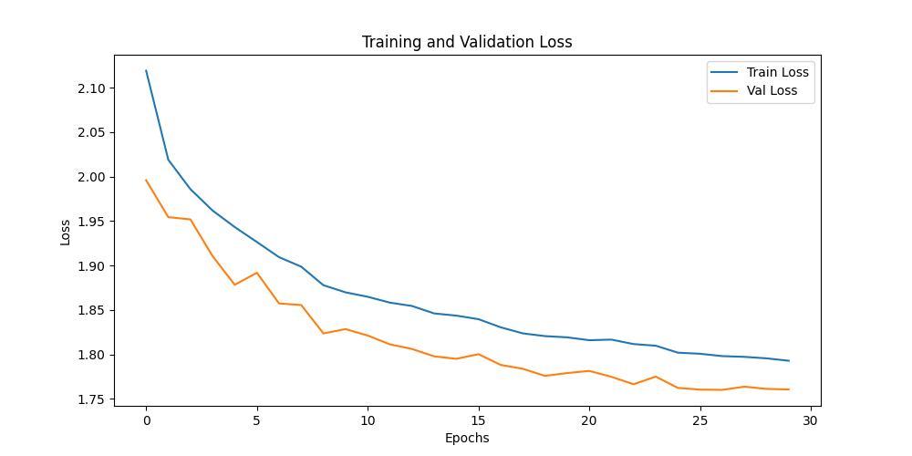
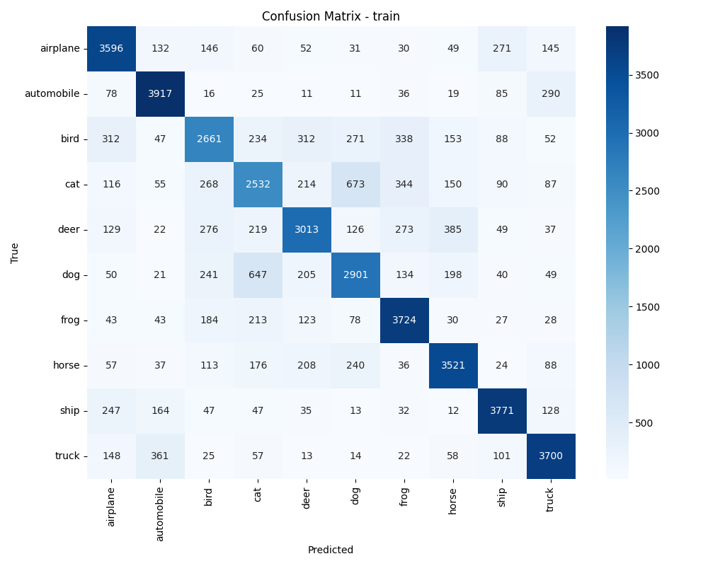
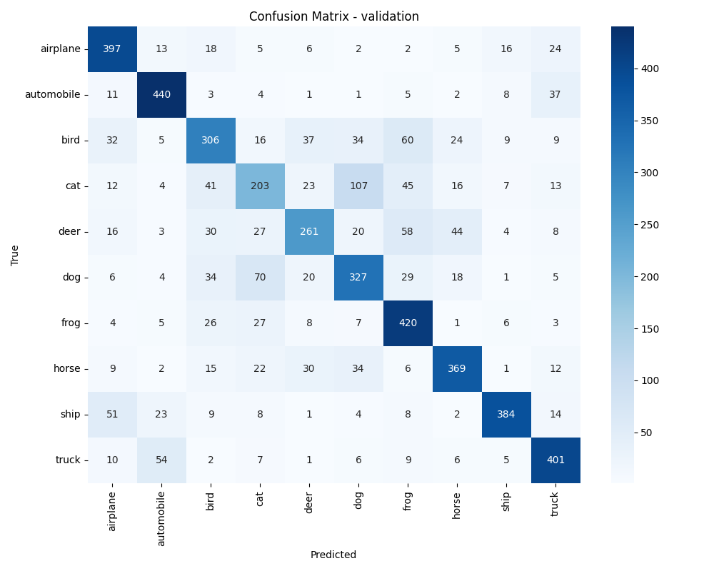
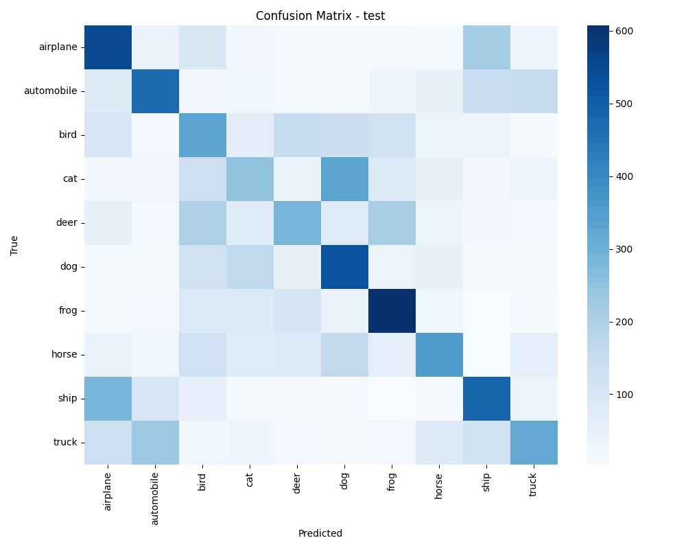

# Exercise 1: Create a Deep Learning Model for image classification in PyTorch with CIFAR-10 dataset

## Objective

En los ejercicios 4 y 5 se desarrolla un modelo capaz de clasificar imágenes del conjunto de datos CIFAR-10. 

En el ejecicio 4 se implementa una red neuronal convolucional (CNN) y en el ejercicio 5 un modelo basado en un perceptrón multicapa (MLP) con capas FullyConnected.

En cada ejercicio el archivo evaluate.py se encargará de evaluar los modelos entrenados y calcular métricas relevantes como la matriz de confusión, la accuracy y el F1-score. 

Finalmente, se comparan ambos enfoques y se analiza el impacto de la técnica de data augmentation en la capacidad de generalización del modelo.


## Task Formalization

El ejercicio es una tarea de clasificación supervisada de imágenes. 

El modelo recibe como entrada imágenes pequeñas en color del dataset CIFAR-10 y debe asignarlas a una de las diez clases posibles. Las etiquetas se representan mediante codificación one-hot, de modo que cada clase se expresa como un vector binario con un único valor igual a uno. 

El flujo general del sistema se compone de dos etapas: entrenamiento del modelo y validación, y evaluación final mediante métricas de clasificación. 

### Task Formalization (Inference)

Durante la fase de inferencia se emplea imagenes del dataset CIFAR-10 nuca vistas antes para predecir la clase de imágenes.Se comprueba la capacidad del modelo para generalizar y se aplican las métricas.

### Task Formalization (Training)

En la etapa de entrenamiento se optimizan los parámetros del modelo utilizando aprendizaje supervisado. El modelo convolucional procesa la imagen a través de filtros jerárquicos que extraen características espaciales relevantes antes de emitir una probabilidad por clase. La predicción final corresponde a la clase con mayor probabilidad estimada.

Las imágenes del conjunto de entrenamiento pasan por vario filtros (kernel) hasta llegar a clasificar la imagen en una de las posibles categorias. EL modelo calcula la función de pérdida comparando las predicciones con las etiquetas reales y posteriormente se actualizan los pesos de los kernel utilizados. 

La validación se realiza de forma periódica para supervisar la capacidad de generalización y seleccionar el mejor modelo.

## Evaluation metrics

Para evaluar el rendimiento del modelo se utilizan métricas propias de clasificación multiclase. La accuracy mide la proporción de predicciones correctas sobre el total de muestras, mientras que el F1-score permite equilibrar precisión y exhaustividad en cada clase: 
- Precisión: Proporción de predicciones positivas correctas (verdaderos positivos) sobre el total de predicciones positivas.

- Recall (Exhaustividad): Proporción de casos positivos reales detectados correctamente.

La matriz de confusión proporciona una visión detallada de los aciertos y errores por categoría, facilitando la identificación de patrones de confusión entre clases similares.

## Data Considerations

### Dataset description

#### CIFAR-10 Dataset Overview

El conjunto de datos CIFAR-10 está compuesto por 60.000 imágenes en color de 32x32 píxeles distribuidas equitativamente en diez clases: avión, automóvil, pájaro, gato, ciervo, perro, rana, caballo, barco y camión. El dataset original se divide en 50.000 imágenes para entrenamiento y 10.000 para prueba.

#### Partición de Datasets: Train, Validation y Test

En Machine Learning es fundamental dividir los datos en 3 conjuntos independientes:

| **Conjunto** | **Propósito** | **¿Cuándo se usa?** |
|--------------|---------------|-------------------|
| **Train** | Entrenar el modelo (ajustar pesos) | Durante cada época de entrenamiento |
| **Validation** | Seleccionar mejor modelo y ajustar hiperparámetros | Durante entrenamiento para early stopping |
| **Test** | Evaluación final del modelo | Solo al final, para reportar rendimiento real |

#### Metodología seleccionada

##### **Metodología Estándar:**
```python
# Descargar datasets originales
train_cifar10 = CIFAR10Dataset(root, train=True, ...)   # 50,000 muestras
test_cifar10 = CIFAR10Dataset(root, train=False, ...)   # 10,000 muestras

# Partir train_cifar10 en train + validation
train_dataset = train_cifar10[:40,000]  # 40k para entrenar
val_dataset = train_cifar10[40,000:]    # 10k para validación
test_dataset = test_cifar10             # 10k para test final
```

**Distribución final:** 40k train + 10k validation + 10k test

##### **Opción más simple:**
```python
# Usar test original como validation
train_dataset = CIFAR10Dataset(root, train=True, ...)   # 50k para entrenar
val_dataset = CIFAR10Dataset(root, train=False, ...)    # 10k test como validation
# ¿No hay test verdadero?
```

Se ha optado por la distribución estándar de dividir las imagenes de train entre train y validation para no afectar a las imagenes de test. Se ha elegido seguir esta metodologia ya que usar Test como Validation tiene varios inconvenientes. Se suele llamar Data Leakage, y ocurre cuando:

- El modelo "ve" el conjunto de test durante el entrenamiento
- Se pierde la evaluación completamente ciega, los hiperparámetros se ajustan según el "test"
- Resultado:  optimismo sesgado en las métricas finales, rendimiento inflado.


### Data preparation and preprocessing

Como se ha explicado anteriormente, se utiliza la división estándar de CIFAR-10:
- **Train (40k, 80%)** + **Validation (10k, 20%)** del conjunto original de entrenamiento
- **Test (10k)** se mantiene intacto para evaluación final

### Data augmentation

**Aplicado solo al conjunto de entrenamiento:**
- **RandomHorizontalFlip()**: Volteo horizontal aleatorio para aumentar variabilidad
- **RandomCrop(32, padding=4)**: Recortes aleatorios con padding para simular traslaciones

El objetivo es mejorar la generalización del modelo CNN y reducir overfitting

## Model Considerations

**Arquitectura CNN estilo VGGnet:**
- **2 bloques convolucionales**: 3→16→32 canales con ReLU y MaxPooling
- **Clasificador denso**: Flatten + Linear(8192→256) + ReLU + Dropout(0.3) + Linear(256→10)
- **Activación final**: Softmax para probabilidades de clase
- **Parámetros**: ~2.1M parámetros, adecuado para CIFAR-10

### Suitable Loss Functions

**Para clasificación multiclase (10 clases CIFAR-10):**
- **CrossEntropyLoss**: Combina LogSoftmax + NLLLoss, estándar para multiclase
- **MultiMarginLoss**: Alternativa con margen, menos común
- **FocalLoss**: Para datasets desbalanceados (no es el caso de CIFAR-10)

### Selected Loss Function

Para una tarea de clasificación multiclase como CIFAR-10, la función de pérdida más adecuada es CrossEntropyLoss, ya que combina la aplicación de LogSoftmax con la pérdida negativa logarítmica, permitiendo trabajar directamente con los logits generados por el modelo..

### Possible architectures

#### Modelo CNN Optimizado con Global Average Pooling

##### Arquitectura del Modelo Implementado

Hemos implementado un modelo CNN extremadamente optimizado para sistemas con recursos limitados, utilizando **Global Average Pooling (GAP)** como técnica principal de reducción de parámetros:

```python
class Cifar10CNN(nn.Module):
    def __init__(self, num_classes=10):
        super().__init__()
        
        # Feature extractor con canales reducidos (3→8→16)
        self.features = nn.Sequential(
            nn.Conv2d(3, 8, kernel_size=3, padding=1),
            nn.ReLU(),
            nn.Conv2d(8, 16, kernel_size=3, padding=1), 
            nn.ReLU(),
            nn.MaxPool2d(kernel_size=2, stride=2),
        )
        
        # Global Average Pooling: [B,16,16,16] → [B,16,1,1]
        self.global_avg_pool = nn.AdaptiveAvgPool2d((1, 1))
        
        # Clasificador minimalista: 16 → 10 clases directamente
        self.classifier = nn.Sequential(
            nn.Flatten(),
            nn.Dropout(p=0.2),
            nn.Linear(16, num_classes),
        )
```

Esta configuración está optimizada para recursos limitados:

- **Batch Size**: 16 (reducido de 32 para menor uso de memoria)
- **Épocas**: 30 (reducido de 70 para entrenamiento más rápido)  
- **Learning Rate**: 5e-4 (ajustado para modelo más pequeño)
- **Workers**: 0 (evita problemas de multiprocessing en Windows)

### Resultados del Modelo Original (Underfitting Severo)

#### Gráficos de Loss y Accuracy de modelo con GAP


#### Matriz de Confusión de Validación


### Análisis de Underfitting 

1. **Capacidad insuficiente**: El modelo es demasiado simple para CIFAR-10
2. **Loss alto en train y val**: Indica que no puede aprender patrones básicos
3. Accuracy muy baja
4. La matriz de confusión muestra resultadospoco satisfactorios.


El modelo actual sacrifica demasiado rendimiento por eficiencia. Se necesita encontrar un punto medio que mantenga viabilidad en recursos limitados pero permita aprendizaje efectivo.

---

## Cambio de Arquitectura: De GAP a VGGnet

### Descripción del Cambio

Debido al underfitting severo detectado en el modelo anterior, se decidió cambiar la arquitectura del Global Average Pooling (GAP) a una arquitectura VGGnet que proporcione mayor capacidad de aprendizaje.

### Tabla Comparativa de Arquitecturas

| **Aspecto** | **Modelo Anterior (GAP)** | **Modelo Actual (VGGnet)** |
|-------------|---------------------------|----------------------------|
| **Descripción** | CNN minimalista con GAP | CNN estilo VGGnet tradicional |
| **Canales Conv** | 3 → 8 → 16 | 3 → 16 → 32 |
| **Feature Extraction** | 2 Conv + GAP | 2 Conv + MaxPool |
| **Pooling** | AdaptiveAvgPool2d(1,1) | MaxPool2d(2,2) |
| **Clasificador** | Flatten → Dropout → Linear(16,10) | Flatten → Linear(8192,256) → ReLU → Dropout → Linear(256,10) |
| **Activación Final** | Sin Softmax | nn.Softmax(dim=1) |
| **Parámetros Totales** | ~1,500 | ~2,100,000 |
| **Factor de Cambio** | Base | 1400x más parámetros |


### Arquitectura Final Implementada

```python
class Cifar10CNN(nn.Module):
    def __init__(self, num_classes=10):
        super().__init__()
        
        # Feature extractor estilo VGGnet
        self.features = nn.Sequential(
            nn.Conv2d(3, 16, kernel_size=3, padding=1),    # 3→16 canales
            nn.ReLU(inplace=True),
            nn.Conv2d(16, 32, kernel_size=3, padding=1),   # 16→32 canales
            nn.ReLU(inplace=True),
            nn.MaxPool2d(kernel_size=2, stride=2),         # 32×32→16×16
        )
        
        # Clasificador tradicional VGGnet
        self.classifier = nn.Sequential(
            nn.Flatten(),                    # 32×16×16 = 8192
            nn.Linear(8192, 256),           # Capa densa intermedia
            nn.ReLU(inplace=True),
            nn.Dropout(p=0.3),             # Regularización
            nn.Linear(256, 10),            # Salida a 10 clases
            nn.Softmax(dim=1)              # Probabilidades
        )
```

### Expectativas de Rendimiento

Con esta nueva arquitectura se ha obtenido un accuracy del 70%, que el modelo converga (loss descendente y estable) y que el modelo tenga buena capacidad de generalización.

Si embargo, al aumentar el modelo también hemos aumentado el tiempo de entrenamiento y el uso de memoria.

### Last layer activation

La capa final utiliza una función Softmax para convertir los logits en probabilidades normalizadas cuya suma es igual a uno, permitiendo interpretar cada salida como el nivel de confianza del modelo en cada clase.


### Other Considerations

Se han implementado las siguientes tecnicas en el modelo:

- **Dropout(0.3)**: Regularización para prevenir overfitting
- **Padding=1**: Mantiene dimensiones espaciales en convoluciones
- **Flatten**: Convierte feature maps 2D a vector 1D para clasificador

## Training

El proceso de entrenamiento consiste en una fase de propagación hacia adelante, cálculo de la pérdida, retropropagación del error y actualización de los parámetros mediante un optimizador AdamW con regularización L2. Se monitoriza la accuracy en validación para aplicar early stopping y conservar el modelo con mejor desempeño.

### Training hyperparameters

- **Batch Size**: 32 (balance entre estabilidad y memoria)
- **Learning Rate**: 5e-4 (conservador para convergencia estable)
- **Optimizer**: AdamW con weight_decay=1e-4 (regularización L2)
- **Épocas**: 60 con early stopping basado en validation accuracy
- **Criterio**: CrossEntropyLoss para clasificación multiclase

### Loss function graph


### Discussion of the training process

Durante el entrenamiento del modelo basado en Global Average Pooling se observó un estancamiento temprano de la pérdida y una accuracy cercana al azar, lo que evidenció un caso claro de underfitting. Tras aumentar la capacidad mediante una arquitectura tipo VGG, la pérdida mostró una tendencia descendente más estable y la accuracy mejoró significativamente tanto en entrenamiento como en validación. El uso de regularización y data augmentation permitió controlar el posible sobreajuste derivado del incremento de parámetros.

## Evaluation

### Evaluation metrics

La evaluación final se realiza sobre los conjuntos de entrenamiento, validación y prueba utilizando accuracy, F1-score y matriz de confusión.




Metrics for each dataset is depicted: 


### Evaluation results

Here you have examples of evaluation results for train, validation and test sets.

Example for train set:




Example for validation set:




Example for test set:



Los resultados muestran una mejora sustancial al pasar del modelo con Global Average Pooling al modelo convolucional tipo VGG. Mientras que el primero presentaba un rendimiento cercano a la clasificación aleatoria, el segundo alcanza valores de accuracy considerablemente superiores y una matriz de confusión con mayor concentración en la diagonal principal, lo que indica un mayor número de predicciones correctas.


### Discussion of the results

El modelo resuelve el problema extrayendo características jerárquicas mediante convoluciones y transformándolas posteriormente en decisiones de clasificación a través de capas densas. 

El primer modelo con GAP presentó underfitting debido a su limitada capacidad representacional. 

El segundo modelo con arquitectura VGG permitió aprender patrones más complejos, aunque con mayor costo computacional. La combinación de mayor capacidad y técnicas de regularización favorece una buena generalización sobre datos similares a los de entrenamiento.


## Design Feedback loops

### Proceso de Mejora del Modelo

En una primera fase se priorizó la eficiencia computacional mediante un modelo con muy pocos parámetros. Tras analizar las métricas y detectar underfitting, se decidió aumentar la complejidad del modelo adoptando una arquitectura más profunda y robusta. Este cambio produjo una mejora significativa en el rendimiento.

El proceso de diseño se basó en el analisis de la pérdida, la accuracy y la matriz de confusión, para comprobar la capacidad de generalización del modelo y detección de problemas como underfitting o overfitting (no presente en este ejecicio).

## Questions

### Which are the differences you found between the implemented models?

El modelo anterior, basado en Global Average Pooling, presentaba una capacidad muy limitada y no lograba aprender representaciones discriminativas adecuadas, lo que resultó en underfitting severo. El modelo actual, inspirado en VGG, incrementa significativamente el número de parámetros y la profundidad, permitiendo capturar patrones espaciales más complejos y alcanzar un rendimiento notablemente superior.

### Does the model generalizes well to new data?

El modelo convolucional presenta una buena capacidad de generalización cuando los datos nuevos comparten características similares con CIFAR-10, como tamaño reducido y objetos relativamente centrados. Las convoluciones favorecen la invariancia a pequeñas traslaciones y la reutilización de filtros, lo que reduce el riesgo de sobreajuste. No obstante, la generalización puede verse limitada ante cambios drásticos de dominio, resolución o distribución de datos. En condiciones similares al dataset original, se espera un comportamiento robusto y estable.