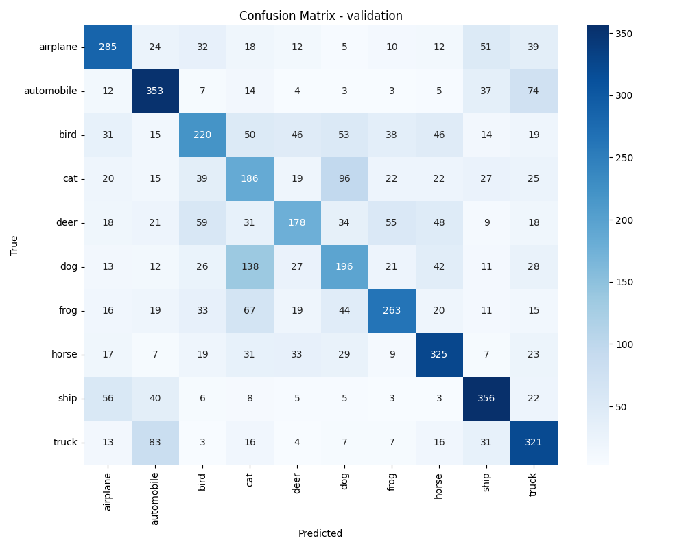
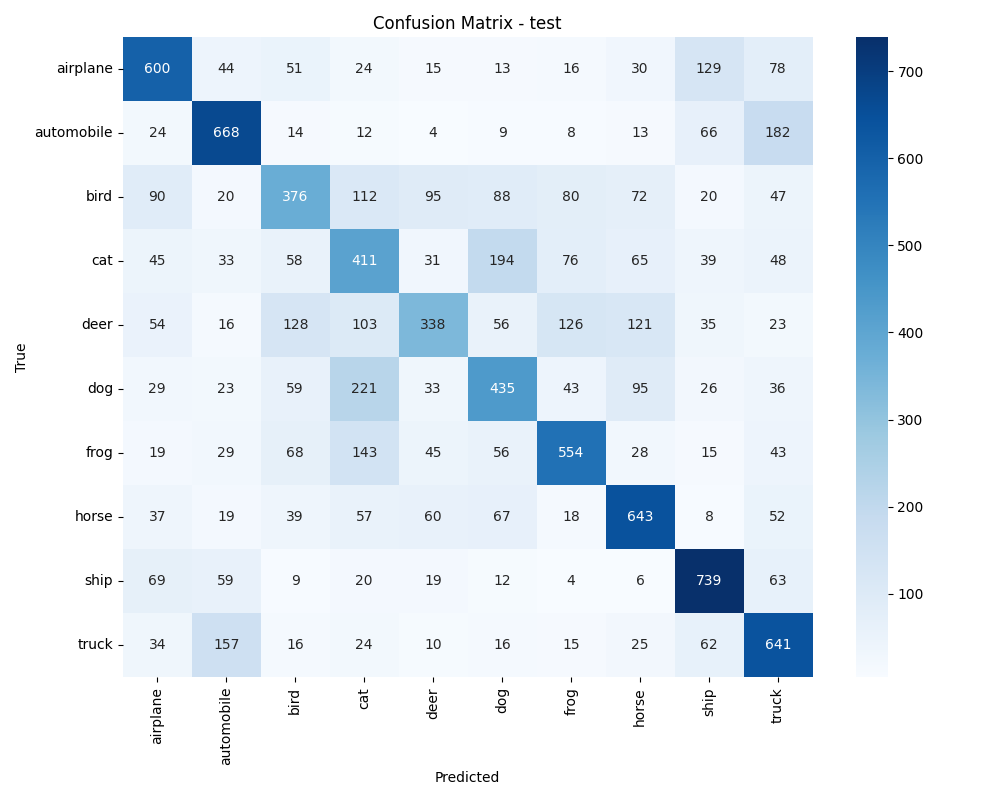
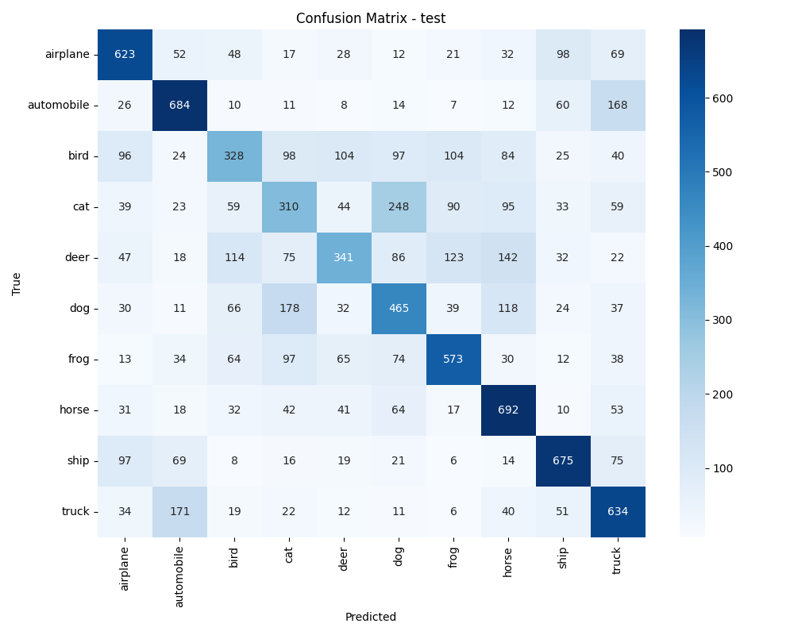

# Exercise 1: Create a Deep Learning Model for image classification in PyTorch with CIFAR-10 dataset

## Objective

El objetivo es desarrollar un modelo capaz de clasificar imágenes del conjunto de datos CIFAR-10. En una primera aproximación, se implementa un modelo compuesto únicamente por capas totalmente conectadas (MLP), sin utilizar capas convolucionales.

Además, se crea un archivo evaluate.py cuya función es evaluar el modelo entrenado y calcular métricas relevantes de clasificación, tales como la accuracy, el F1-score y la matriz de confusión, almacenando estos resultados para su análisis posterior.

### Conclusiones

Al sustituir una red convolucional (CNN) por una red multicapa totalmente conectada (MLP), se observa un fenómeno claro de sobreajuste (overfitting). Este comportamiento se refleja en que el loss sobre el conjunto de validación es mayor que el loss sobre el conjunto de entrenamiento. En otras palabras, el modelo aprende muy bien las imágenes utilizadas durante el entrenamiento, pero cuando se enfrenta a datos nuevos no logra generalizar adecuadamente.

Desde el punto de vista teórico, el sobreajuste puede mitigarse reduciendo la complejidad del modelo, es decir, utilizando arquitecturas más pequeñas que obliguen a aprender representaciones más generales en lugar de memorizar los datos. Sin embargo, en este caso, disminuir el tamaño del modelo no produjo una mejora significativa en el rendimiento sobre validación.

Una explicación posible para este suceso puede ser la propia naturaleza de los modelos MLP. A diferencia de las CNN, que explotan la estructura espacial de las imágenes mediante convoluciones y compartición de parámetros, los MLP son altamente dependientes de la posición de los píxeles en el vector de entrada. Esto significa que cualquier variación espacial en la imagen puede afectar considerablemente la predicción. Por esta razón, incluso modificando la arquitectura o el tamaño del modelo, es poco probable que un MLP alcance un rendimiento comparable al de una CNN en tareas de clasificación de imágenes como CIFAR-10.


## Task Formalization

El objetivo de esta tarea es implementar un modelo de clasificación de imágenes del conjunto CIFAR-10 utilizando exclusivamente capas totalmente conectadas (MLP), con el propósito de compararlo con el enfoque basado en redes convolucionales desarrollado previamente. 

La hipótesis es que un modelo MLP puro debería presentar un rendimiento inferior al de una CNN ya que no tiene en cuenta la estructura espacial de las imágenes.

### Task Formalization (Inference)

En la fase de inferencia se implementan dos arquitecturas distintas de tipo MLP: una con estructura decreciente de 512 → 256 → 128 y otra más compacta de 256 → 128 → 64 para paliar el overfitting. 

Las imágenes de entrada, originalmente de tamaño 32x32x3 píxeles, se aplanan en vectores de 3072 elementos antes de ser procesadas por la red. 

El flujo de datos sigue una secuencia de capas densas, por ejemplo [3072 → 512 → 256 → 128 → 10] o [3072 → 256 → 128 → 64 → 10].

La salida es un vector de 10 probabilidades correspondientes a las clases del dataset. 

### Task Formalization (Training)

Durante el entrenamiento se emplea aprendizaje supervisado. La función de pérdida utilizada es CrossEntropyLoss, adecuada para problemas de clasificación multiclase. 

La optimización se realiza mediante el algoritmo AdamW, incorporando regularización L2 para reducir el riesgo de sobreajuste. 

## Evaluation metrics

- **Accuracy**: definida como el número de clasificaciones correctas dividido entre el total de muestras.
- **F1-Score per class**: evalua el equilibrio entre precisión (true positives detectados) y recall (positivos existentes detectados) en cada categoría.
- **Confusion Matrix**: Análisis de errores de clasificación
- **Curva de loss**: relación del loss y accuracy vs. épocas para detectar overfitting.


## Data Considerations

### Dataset description

El dataset CIFAR-10 está compuesto por 60.000 imágenes en color de tamaño 32x32x3 píxeles distribuidas en 10 clases: airplane, automobile, bird, cat, deer, dog, frog, horse, ship y truck, con una distribución balanceada de 6.000 imágenes por clase.

### Data preparation and preprocessing

En el caso del MLP, el preprocesamiento es un paso crítico, ya que cada imagen debe aplanarse, pasando de una representación tridimensional (32, 32, 3) a un vector unidimensional de 3072 elementos. Esta transformación implica una pérdida de información espacial, dado que el modelo deja de preservar las relaciones locales entre píxeles vecinos, lo que constituye una limitación importante frente a las arquitecturas convolucionales.

La división de los datos sigue una metodología adecuada para evitar filtraciones de información. El conjunto original de entrenamiento de CIFAR-10 (50.000 imágenes) se divide en 40.000 imágenes para entrenamiento (80%) y 10.000 para validación (20%). El conjunto de test original (10.000 imágenes) se mantiene intacto y se utiliza exclusivamente para la evaluación final del modelo, para evitar el Data Leakage.

### Data augmentation

Aplicado solo al conjunto de entrenamiento:
- **RandomHorizontalFlip()**: Volteo horizontal aleatorio
- **RandomCrop(32, padding=4)**: Recortes aleatorios con padding

El data augmentation tiene menor impacto en MLP que en CNN, ya que al aplanar las imágenes se pierde la estructura espacial que las transformaciones pretenden preservar.

## Model Considerations

Arquitectura MLP (MultiPerceptron):
- **Input**: 3072 neuronas (32x32x3 imágenes aplanadas)
- **Hidden layers (modelo grande)**: [512, 256, 128] neuronas con activación ReLU
- **Hidden layers (modelo pequeño)**: [256, 128, 64] neuronas con activación ReLU
- **Output**: 10 neuronas (clases CIFAR-10)
- **Limitación crítica**: Pierde información espacial al aplanar imágenes

### Suitable Loss Functions

- **CrossEntropyLoss**: Ideal para clasificación multiclase.
- **MultiMarginLoss**:  maximiza el margen entre la clase correcta y las clases incorrectas.
- **FocalLoss**: Para datasets desbalanceados (no aplicable a CIFAR-10).

### Selected Loss Function

Se ha seleccionado CrossEntropyLoss porque es estable y eficiente para clasificación multiclase.

### Possible architectures

**Primera arquitectura:**
```python
MultiPerceptron(
    input_dim=3072,     # 32x32x3 aplanado
    hidden_dims=[512, 256, 128],
    output_dim=10       # Clases CIFAR-10
)
```
Y para intentar paliar el overfitting se ha reducido el modelo a:

**Segunda arquitectura:**

```python
MultiPerceptron(
    input_dim=3072,     # 32x32x3 aplanado
    hidden_dims=[256, 128, 64],
    output_dim=10       # Clases CIFAR-10
)
```


### Last layer activation

Sin activación explícita en la salida, CrossEntropyLoss ya incluye LogSoftmax internamente. 

### Other Considerations

Aspectos técnicos del MLP:
- **Aplanamiento**: La transformación de (3,32,32) a (3072,) pierde estructura espacial.
- **ReLU activation**: Evita vanishing gradient en capas profundas.
- **Modelo dependiente de posición**: Cada neurona conectada a píxeles específicos.

## Training

Proceso de entrenamiento MLP:
- **Loss calculation**: CrossEntropyLoss entre logits y etiquetas
- **Optimizer step**: AdamW actualiza pesos matriciales
- **Validation**: Evaluación periódica sin actualización de pesos

### Training hyperparameters

- **Batch Size**: 32
- **Learning Rate**: 5e-4 (conservador)
- **Optimizer**: AdamW con weight_decay=1e-4
- **Épocas**: 60 con early stopping
- **Criterio**: CrossEntropyLoss

### Loss function graph


Podemos ver como en ambos plots de loss se observa overfitting. Aunque en el segundo modelo mas pequeño parece que tarda mas en sobrepasar el loss de validacion al de train, en ambos casos el modelo no generaliza bien.

### Discussion of the training process

En comparación con una CNN, la convergencia del modelo es más lenta, ya que el modelo no aprovecha la estructura espacial de las imágenes y debe aprender patrones relevantes únicamente a partir de vectores aplanados. Esta limitación dificulta la extracción eficiente de características discriminativas.

Asimismo, se observó un alto riesgo de overfitting debido al elevado número de parámetros en relación con la información estructural que realmente puede explotar el modelo. Al no preservar relaciones locales entre píxeles, el MLP tiende a memorizar patrones específicos del conjunto de entrenamiento en lugar de aprender representaciones generalizables.

Las curvas de aprendizaje reflejan esta dificultad, mostrando en algunos casos un comportamiento más inestable o errático en la pérdida, especialmente en validación. 

## Evaluation

### Evaluation metrics

- **Accuracy general:** Proporción total de predicciones correctas respecto al número total de muestras evaluadas. Indica el rendimiento global del modelo.

- **Confusion Matrix:** Tabla que compara las etiquetas reales con las predicciones del modelo, permitiendo identificar en qué clases se cometen más errores.

- **Per-class F1-score:** Métrica calculada para cada clase individualmente, que combina precisión y recall, mostrando qué tan bien se desempeña el modelo en cada categoría de CIFAR-10.

- **Train/Val/Test comparison:** Comparación del rendimiento entre entrenamiento, validación y prueba para detectar sobreajuste (mejor en train que en val/test) o subajuste (bajo rendimiento en todos).

Metrics for each dataset is depicted: 

Modelo pequeño:


Modelo grande:


### Evaluation results

Here you have examples of evaluation results for train, validation and test sets.

Example for validation set:

Resultados modelo grande:



Resultado modelo pequeño:


Example for test set:

Resultados modelo grande:



Resultado modelo pequeño:




### Discussion of the results

El MLP presenta varias limitaciones estructurales. Al aplanar la imagen, se pierde la relación entre píxeles vecinos, eliminando información espacial clave. Además, el modelo es altamente sensible a cambios de posición, rotaciones o pequeñas traslaciones de los objetos. Dado que cuenta con millones de parámetros, existe un riesgo considerable de overfitting, ya que puede memorizar patrones específicos del conjunto de entrenamiento en lugar de generalizar. Como consecuencia, su accuracy suele ser inferior a la obtenida con arquitecturas convolucionales.

El rendimiento del MLP podría mejorarse mediante técnicas de regularización como dropout o batch normalization, que ayudan a reducir el sobreajuste. También podría aplicarse data augmentation más agresiva, aunque su impacto es limitado debido a la pérdida de estructura espacial. Otra alternativa más efectiva sería adoptar una arquitectura híbrida que combine extracción de características mediante CNN y clasificación con MLP (VGGnet usada en el ejercicio 4). 


### ¿Cómo generaliza a datos nuevos?

La capacidad de generalización del MLP es limitada. Puede funcionar adecuadamente en imágenes muy similares a las de entrenamiento, especialmente si los objetos mantienen posiciones y orientaciones parecidas.

Su rendimiento es aceptable ante variaciones menores cuando los objetos permanecen centrados, pero tiende a degradarse significativamente ante traslaciones, rotaciones o cambios de escala, debido a su sensibilidad posicional y a la ausencia de mecanismos que capturen invariancias espaciales.

## Design Feedback loops

Se quiere demostrar que MLP funciona peor que una red CNN para visión por computadora.

#### Decisiones de Diseño

1. **Arquitectura conservadora**: [512, 256, 128] suficiente para demostrar limitaciones (overfitting)
2. **Hiperparámetros similares**: Mismos que CNN para comparación justa

#### Resultados 

| **Métrica** | **MLP (Exercise 5)** | **CNN (Exercise 4)** | **Diferencia** |
|--------------|---------------------|---------------------|----------------|
| **Accuracy** | 50% | 70% | -20% |
| **Convergencia** | Más lenta | Rápida | MLP peor |
| **Overfitting** | Alto riesgo | Controlado | MLP peor |
| **Robustez** | Baja | Alta | MLP peor |

Se concluye que el modelo MLP no preserva estructura espacial de las imágenes y por tanto para clasificación de imágenes(donde las imágenes son datos que varían mucho en la misma clase, por ejemplo en imágenes de perrros) la red CNN es superior. Además como los modelos MLP no guardan tanta información sobre la posición por el flattening las técnicas de data augmentation son menos efectivas.


## Questions

### Which are the differences you found between previous model and this one?

Diferencias fundamentales CNN (Exercise 4) vs. MLP (Exercise 5):**

| **Aspecto** | **CNN (Exercise 4)** | **MLP (Exercise 5)** |
|-------------|---------------------|---------------------|
| **Input processing** | Preserva estructura 2D (32x32x3) | Aplana a vector 1D (3072) |
| **Feature extraction** | Convoluciones + pooling | Capas densas |
| **Spatial awareness** | Sí (filtros locales) | No (píxeles independientes) |
| **Accuracy** | 70% | 50% |
| **Robustez** | Alta a transformaciones | Baja a cambios espaciales |

### Does the model generalizes well to new data?

El modelo MLP generaliza peor que una CNN debido a limitaciones estructurales propias de su arquitectura. 

Al estar compuesto únicamente por capas totalmente conectadas, cada neurona se enlaza con píxeles específicos del vector de entrada, lo que lo hace fuertemente dependiente de la posición. Esto implica que cualquier cambio espacial en la imagen, como traslaciones o rotaciones, puede afectar significativamente la predicción. 

Además, al aplanar la imagen se pierde el contexto local y las relaciones entre píxeles vecinos, por lo que el modelo no captura patrones espaciales relevantes ni desarrolla invariancia ante transformaciones como cambios de escala.

En términos prácticos, el MLP puede generalizar razonablemente bien cuando los datos nuevos siguen exactamente la misma distribución que CIFAR-10 y los objetos aparecen en posiciones similares a las vistas durante el entrenamiento. Sin embargo, su rendimiento se vuelve regular cuando existen pequeñas variaciones en la ubicación de los objetos y claramente pobre cuando se presentan desplazamientos, rotaciones o cambios de escala más marcados.
