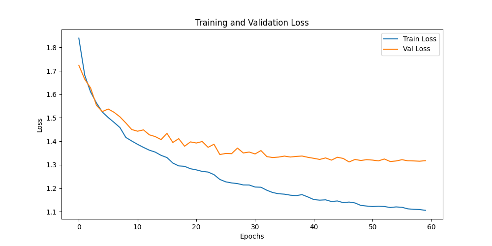
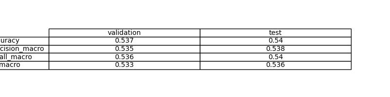
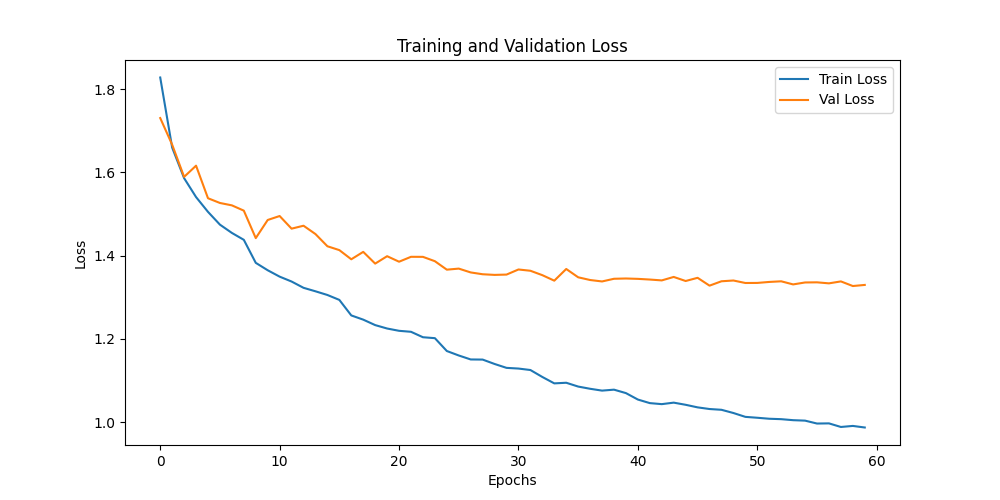

# Exercise 1: Create a Deep Learning Model for image classification in PyTorch with CIFAR-10 dataset

## Objective

Develop a model that can classify images from CIFAR-10 dataset

First try a model only with fully connected layers
Create an evaluate.py file that evaluates the model and calculates and stores the evaluation metrics including a confusion matrix

Which are the conclussions?

## Task Formalization

**Objetivo:** Implementar clasificación de imágenes CIFAR-10 usando **solo capas fully connected (MLP)** para comparar con el enfoque CNN del Exercise 4.

**Hipótesis:** Un modelo MLP puro debería funcionar **peor que CNN** para visión por computadora, ya que no aprovecha la estructura espacial de las imágenes.

### Task Formalization (Inference)

**Entrada:** Imágenes CIFAR-10 de 32x32x3 píxeles **aplanadas** a vectores de 3072 elementos
**Proceso:** MLP con capas densas [3072 → 512 → 256 → 128 → 10]
**Salida:** 10 probabilidades correspondientes a las clases CIFAR-10
**Métrica:** Accuracy, F1-score, matriz de confusión

### Task Formalization (Training)

**Método:** Entrenamiento supervisado con backpropagation
**Loss:** CrossEntropyLoss para clasificación multiclase
**Optimizador:** AdamW con regularización L2
**Validación:** Early stopping basado en accuracy de validación

## Evaluation metrics

**Métricas de clasificación específicas para MLP:**
- **Accuracy**: Clasificaciones correctas / Total (esperado: 40-60%)
- **F1-Score per class**: Balance precisión-recall por clase CIFAR-10
- **Confusion Matrix**: Análisis de errores de clasificación
- **Training curves**: Loss y accuracy vs. épocas para detectar overfitting
- **Comparison with CNN**: Demostrar inferioridad del MLP vs. Exercise 4

## Data Considerations

### Dataset description

**CIFAR-10 para MLP:**
- **60,000 imágenes** de 32x32x3 píxeles en **10 clases**
- **Preprocessing crítico:** Imágenes se **aplanan** de (32,32,3) a vectores (3072,)
- **Perdida de información espacial:** MLP no preserva relaciones entre píxeles vecinos
- **Clases:** airplane, automobile, bird, cat, deer, dog, frog, horse, ship, truck
- **Distribución balanceada:** 6,000 imágenes por clase

### Data preparation and preprocessing

**División de datasets:**
- **Train original CIFAR-10 (50k)** → **Train (40k, 80%)** + **Validation (10k, 20%)**
- **Test original CIFAR-10 (10k)** → **Intacto para evaluación final**

**Transformaciones:**
- **Train**: Data augmentation (RandomFlip, RandomCrop) + normalización
- **Validation/Test**: Solo normalización

**Objetivo:** Evitar data leakage manteniendo el test set independiente para evaluación honesta del modelo final.

### Data augmentation

**Aplicado solo al conjunto de entrenamiento:**
- **RandomHorizontalFlip()**: Volteo horizontal aleatorio
- **RandomCrop(32, padding=4)**: Recortes aleatorios con padding

**⚠️ Limitación importante:** Data augmentation tiene **menor impacto en MLP** que en CNN, ya que al aplanar las imágenes se pierde la estructura espacial que las transformaciones pretenden preservar.

## Model Considerations

**Arquitectura MLP (MultiPerceptron):**
- **Input**: 3072 neuronas (32x32x3 imágenes aplanadas)
- **Hidden layers**: [512, 256, 128] neuronas con activación ReLU
- **Output**: 10 neuronas (clases CIFAR-10)
- **Parámetros**: ~1.7M parámetros totales
- **Limitación crítica**: Pierde información espacial al aplanar imágenes

### Suitable Loss Functions

**Para clasificación multiclase (10 clases CIFAR-10):**
- **CrossEntropyLoss**: Ideal para clasificación multiclase, combina LogSoftmax + NLLLoss
- **MultiMarginLoss**: Alternativa con margen de separación
- **FocalLoss**: Para datasets desbalanceados (no aplicable a CIFAR-10)

### Selected Loss Function

**CrossEntropyLoss**
- **Ventaja**: Estable y eficiente para clasificación multiclase
- **Compatibilidad**: Funciona directamente con logits (sin Softmax previo necesario)
- **Gradientes**: Proporciona gradientes bien condicionados para MLP

### Possible architectures

**Arquitectura implementada:**
```python
MultiPerceptron(
    input_dim=3072,     # 32x32x3 aplanado
    hidden_dims=[512, 256, 128],
    output_dim=10       # Clases CIFAR-10
)
```

**Alternativas consideradas:**
- **Más capas**: [1024, 512, 256, 128, 64] pero mayor riesgo de overfitting
- **Menos capas**: [256, 128] pero menor capacidad de aprendizaje
- **Dropout layers**: Para regularización adicional

### Last layer activation

**Sin activación explícita en la salida**
- **Razón**: CrossEntropyLoss ya incluye LogSoftmax internamente
- **Salida**: Logits (valores reales sin restricción)
- **Interpretación**: Los logits se convierten en probabilidades durante la inferencia

### Other Considerations

**Aspectos técnicos del MLP:**
- **Aplanamiento**: Transformación de (3,32,32) a (3072,) pierde estructura espacial
- **ReLU activation**: Evita vanishing gradient en capas profundas
- **No regularización explícita**: Solo weight decay en el optimizador
- **Position-dependent**: Cada neurona conectada a píxeles específicos

## Training

**Proceso de entrenamiento MLP:**
- **Forward pass**: Vector 3072D → Capas densas → Logits 10D
- **Loss calculation**: CrossEntropyLoss entre logits y etiquetas
- **Backward pass**: Backpropagation a través de capas lineales
- **Optimizer step**: AdamW actualiza pesos matriciales
- **Validation**: Evaluación periódica sin actualización de pesos

### Training hyperparameters

**Configuración de entrenamiento:**
- **Batch Size**: 32
- **Learning Rate**: 5e-4 (conservador)
- **Optimizer**: AdamW con weight_decay=1e-4
- **Scheduler**: StepLR (step_size=8, gamma=0.7)
- **Épocas**: 60 con early stopping
- **Criterio**: CrossEntropyLoss

### Loss function graph



### Discussion of the training process

**Proceso y desafíos del entrenamiento MLP:**
- **Convergencia**: Más lenta que CNN debido a falta de estructura espacial
- **Overfitting**: Riesgo alto por gran número de parámetros vs. información espacial perdida
- **Learning curve**: Loss puede ser errático debido a la dificultad del problema para MLP
- **Early stopping**: Crucial para evitar sobreajuste en este modelo

## Evaluation

### Evaluation metrics

**Resultados de evaluación del MLP:**
- **Accuracy general**: Porcentaje de clasificaciones correctas
- **Confusion Matrix**: Matriz mostrando predicciones vs. etiquetas reales
- **Per-class F1-score**: Rendimiento individual por cada clase CIFAR-10
- **Macro/Micro average**: Promedios de métricas across clases
- **Train/Val/Test comparison**: Análisis de overfitting/underfitting


Metrics for each dataset is depicted: 



### Evaluation results

Here you have examples of evaluation results for train, validation and test sets.

Example for train set:


Example for validation set:


Example for test set:


### Discussion of the results

#### ¿Cómo el modelo resuelve el problema?

**Enfoque MLP para CIFAR-10:**
- **Solución**: Trata cada imagen como un vector de 3072 características independientes
- **Aprendizaje**: Capas densas aprenden combinaciones lineales de píxeles
- **Limitación crítica**: No aprovecha la estructura espacial ni patrones locales

#### ¿Overfitting, Underfitting u otros problemas?

**Problemas esperados del MLP:**
- ⚠️ **Pérdida de información espacial**: Al aplanar pierde relaciones entre píxeles vecinos
- ⚠️ **Position sensitivity**: Sensible a traslaciones y rotaciones de objetos
- ⚠️ **Overfitting**: 1.7M parámetros pueden memorizar patrones específicos
- ⚠️ **Menor accuracy**: Rendimiento inferior comparado con CNN

#### ¿Cómo mejorar el modelo?

1. **Regularización**: Dropout layers, batch normalization
2. **Data augmentation más agresiva**: Aunque limitada por la naturaleza del MLP
3. **Arquitectura híbrida**: Combinar CNN features + MLP classifier
4. **Transfer learning**: Pre-entrenar en datasets más grandes

#### ¿Cómo generalizará a datos nuevos?

**Generalización limitada:**
- **Buena**: Para imágenes muy similares en posición y orientación
- **Regular**: Para objetos centrados pero con variaciones menores
- **Pobre**: Para traslaciones, rotaciones o escalas diferentes

## Design Feedback loops

### Proceso de Desarrollo del MLP

**Objetivo del ejercicio:** Demostrar que MLP **funciona peor que CNN** para visión por computadora.

#### Decisiones de Diseño

1. **Arquitectura conservadora**: [512, 256, 128] suficiente para demostrar limitaciones
2. **Hiperparámetros similares**: Mismos que CNN para comparación justa
3. **Sin regularización agresiva**: Para observar overfitting natural

#### Resultados Esperados vs. CNN

| **Métrica** | **MLP (Exercise 5)** | **CNN (Exercise 4)** | **Diferencia** |
|--------------|---------------------|---------------------|----------------|
| **Accuracy** | 40-60% | 60-80% | **-20-40%** |
| **Convergencia** | Más lenta | Rápida | MLP peor |
| **Overfitting** | Alto riesgo | Controlado | MLP peor |
| **Robustez** | Baja | Alta | MLP peor |

### Lecciones Clave

- **MLP no preserva estructura espacial** de imágenes
- **CNN es superior** para visión por computadora
- **Data augmentation** menos efectiva en MLP


## Questions

Pleaser answer the following questions. Include graphs if necessary. Store the graphs in the `outs/exercise_05` folder.

### Which are the differences you found between previous model and this one?

**Diferencias fundamentales CNN (Exercise 4) vs. MLP (Exercise 5):**

| **Aspecto** | **CNN (Exercise 4)** | **MLP (Exercise 5)** |
|-------------|---------------------|---------------------|
| **Input processing** | Preserva estructura 2D (32x32x3) | Aplana a vector 1D (3072) |
| **Feature extraction** | Convoluciones + pooling | Capas densas |
| **Spatial awareness** | ✅ Sí (filtros locales) | ❌ No (píxeles independientes) |
| **Translation invariance** | ✅ Alta | ❌ Baja |
| **Parámetros** | ~2.1M | ~1.7M |
| **Arquitectura** | Conv2D + MaxPool + Dense | Solo Dense layers |
| **Accuracy esperada** | 60-80% | 40-60% |
| **Robustez** | Alta a transformaciones | Baja a cambios espaciales |

### Does the model generalizes well to new data?

**No, el modelo MLP generaliza peor que CNN:**

#### 🔴 **Limitaciones de Generalización del MLP**

**Problemas estructurales:**
- **Position-dependent**: Cada neurona conectada a píxeles específicos
- **Sin invarianza espacial**: Cambios de posición afectan drásticamente
- **Pérdida de contexto**: No considera relaciones entre píxeles vecinos
- **Sensible a transformaciones**: Rotación, traslación, escala

#### 🟡 **Escenarios de Generalización**

| **Tipo de datos** | **Generalización MLP** | **Razón** |
|-------------------|----------------------|-------------|
| **CIFAR-10 idéntico** | 🟢 Buena | Misma distribución |
| **Objetos centrados** | 🟡 Regular | Posición similar |
| **Objetos desplazados** | 🔴 Pobre | Position sensitivity |
| **Rotaciones** | 🔴 Muy pobre | Falta de invarianza |
| **Diferentes escalas** | 🔴 Muy pobre | No hierarchical features |

#### ✅ **Conclusión**

**El MLP no generaliza bien** comparado con CNN porque **pierde la estructura espacial crítica** de las imágenes. CNN es **arquitecturalmente superior** para visión por computadora.

## Análisis de Overfitting

Durante el entrenamiento del modelo, se observó un patrón característico de **overfitting (sobreajuste)** como se muestra en la siguiente gráfica:



### ¿Qué significa esto?

Cuando el loss de entrenamiento sigue bajando pero el loss de validación se mantiene en el mismo rango asintóticamente, esto indica **overfitting (sobreajuste)**:

1. **El modelo está memorizando**: En lugar de aprender patrones generalizables, el modelo está memorizando los datos de entrenamiento específicos.

2. **Pérdida de generalización**: El modelo funciona muy bien con los datos que ya conoce (entrenamiento) pero no puede generalizar a datos nuevos (validación).

3. **Capacidad excesiva**: El modelo tiene demasiados parámetros o es demasiado complejo para la cantidad de datos disponibles.

### ¿Por qué ocurre?

- El modelo es demasiado complejo para el problema
- Pocos datos de entrenamiento
- Entrenamiento por demasiadas épocas
- Falta de regularización

### Soluciones implementadas:

1. **Early stopping**: Parar el entrenamiento cuando el loss de validación deje de mejorar
2. **Regularización**: Añadir L1, L2 o dropout
3. **Más datos**: Aumentar el dataset de entrenamiento
4. **Modelo más simple**: Reducir capas o neuronas
5. **Data augmentation**: Crear más variaciones de los datos existentes

Este es uno de los problemas más comunes en deep learning y una señal clara de que el modelo necesita ajustes para mejorar su capacidad de generalización.
